# Exercice 01 — Packet Tracer : miniLab VLAN, DHCP et accès Internet

Test d'admission MSc Cyber — La Plateforme (campus Lille)
Auteur : Marc BOHOUSSOU

---

## 1. Objectif

Construire un réseau d'entreprise sur trois bureaux, segmenté en quatre VLAN,
avec adressage DHCP centralisé, routage inter-VLAN et accès Internet, puis
valider la connectivité.

## 2. Analyse préalable de l'énoncé

L'énoncé demande explicitement de le lire en entier avant de commencer. Cette
lecture fait apparaître **une incohérence entre les deux tableaux fournis**.

Le tableau d'affectation des ports indique :

| Ports | Affectation | VLAN |
|-------|-------------|------|
| 4–5 | Points d'accès Wi-Fi | VLAN 10 |
| 6–7 | PC fixes | VLAN 20 |

Le tableau d'adressage indique l'inverse :

| VLAN | Usage | Réseau |
|------|-------|--------|
| VLAN 10 | PC fixes | 192.168.10.0/24 |
| VLAN 20 | Wi-Fi | 192.168.20.0/24 |

Les deux tableaux s'accordent sur les numéros de VLAN associés aux ports et
aux sous-réseaux ; seule l'étiquette d'usage du second tableau diverge.

**Choix retenu :** le tableau d'affectation des ports fait foi, car il porte
sur des éléments physiques non ambigus, et il préserve la correspondance
mnémotechnique évidente entre numéro de VLAN et sous-réseau
(VLAN 10 → 192.168.**10**.0, VLAN 20 → 192.168.**20**.0).

| VLAN | Ports | Usage retenu | Réseau | Passerelle | Plage DHCP |
|------|-------|--------------|--------|------------|------------|
| 1 | 2–3 | Téléphones IP (VoIP) | 192.168.0.0/24 | 192.168.0.1 | .10 – .50 |
| 10 | 4–5 | Points d'accès Wi-Fi | 192.168.10.0/24 | 192.168.10.1 | .10 – .50 |
| 20 | 6–7 | PC fixes | 192.168.20.0/24 | 192.168.20.1 | .10 – .50 |
| 30 | 8 | Administration | 192.168.30.0/24 | 192.168.30.1 | .10 – .50 |
| — | 1, 9 | Uplinks | TRUNK 802.1Q | — | — |

### Remarque de sécurité sur le VLAN 1

L'énoncé impose la VoIP sur le **VLAN 1**. C'est la configuration demandée et
elle a été respectée, mais elle mérite d'être signalée : le VLAN 1 est le VLAN
par défaut de tout équipement Cisco et le VLAN natif des trunks, donc non
tagué. Deux conséquences :

- tout port laissé en configuration d'usine se retrouve dans le même domaine
  de diffusion que la téléphonie ;
- le VLAN natif est le vecteur du *VLAN hopping* par double tagging.

En production, on déplacerait la VoIP vers un VLAN dédié (VLAN 100 par
exemple), et le VLAN natif du trunk vers un VLAN inutilisé et sans aucun port
actif.

## 3. Topologie

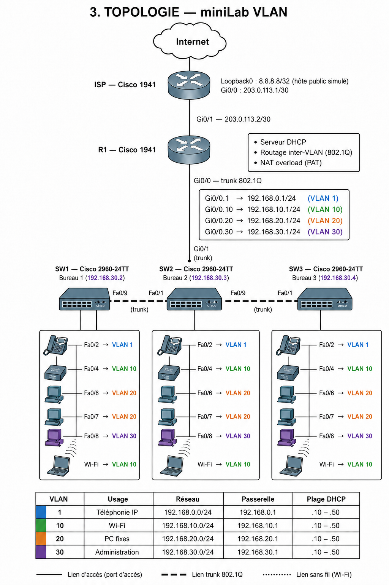


Chaque bureau reçoit, conformément à l'énoncé : 1 switch, 1 point d'accès
Wi-Fi, 1 PC portable (connecté en Wi-Fi), 2 PC fixes, 1 téléphone IP.

### Justification des choix

**Router on a stick.** Le Cisco 1941 ne dispose que de deux interfaces
Gigabit. Avec quatre VLAN à router et une sortie Internet à assurer, une
interface physique par VLAN est impossible. GE0/0 est donc configurée en
trunk 802.1Q et découpée en quatre sous-interfaces, GE0/1 restant dédiée au
WAN.

**Chaînage des switches.** Les trois switches sont chaînés via leurs ports 1
et 9, ce qui correspond exactement à la ligne « Ports 1 et 9 — Uplink
(Ethernet/Fibre) — TRUNK » de l'énoncé. SW2, placé au centre, remonte au
routeur par son port `GigabitEthernet0/1` : cela libère les ports 1 et 9 pour
le chaînage inter-bureaux, et le lien vers la passerelle bénéficie d'un débit
Gigabit puisqu'il agrège le trafic des trois bureaux.

**Filtrage des VLAN sur les trunks.** Les trunks n'autorisent que les VLAN
1, 10, 20 et 30 (`switchport trunk allowed vlan`). Un trunk laissé en
configuration par défaut transporte l'intégralité des VLAN, ce qui élargit
inutilement la surface d'attaque.

## 4. Matériel Packet Tracer

| Équipement | Modèle | Quantité |
|------------|--------|----------|
| Routeur | Cisco 1941 | 1 |
| Switch | Cisco 2960-24TT | 3 |
| Point d'accès | AccessPoint-PT-AC | 3 |
| PC portable | Laptop-PT (module Wi-Fi) | 3 |
| PC fixe | PC-PT | 6 |
| Téléphone IP | Cisco 7960 | 3 |

**Points d'attention lors du montage :**

- Le **Switch-PT est modulaire**. Vérifier que les slots 1 à 9 sont peuplés
  et relever le nom exact des interfaces avec `show ip interface brief` avant
  d'appliquer les configurations. Le port 9 étant décrit comme un uplink
  fibre, y installer un module `PT-SWITCH-NM-1FFE` (et le module
  correspondant sur le switch d'en face).
- Les **PC portables** nécessitent le remplacement du module Ethernet par un
  module Wi-Fi (`PT-LAPTOP-NM-1W`) : éteindre le poste, retirer la carte
  cuivre, insérer la carte sans fil, rallumer.
- Les **téléphones IP** doivent être alimentés (onglet *Physical* → adaptateur
  secteur), sans quoi ils restent éteints. L'IPBX n'est pas à gérer, les
  téléphones servent uniquement à valider l'attribution DHCP sur le VLAN 1.
- Sur les **points d'accès**, configurer le même SSID sur les trois (onglet
  *Config* → Port 1) et le renseigner côté portables.

## 5. Ordre de mise en œuvre

1. Poser les équipements et réaliser le câblage (droit pour terminaux, croisé
   ou fibre pour les liens inter-switches).
2. Appliquer `configs/SW1-bureau1.txt`, `SW2-bureau2.txt`, `SW3-bureau3.txt`.
3. Appliquer `configs/R1-routeur-1941.txt`.
4. Basculer tous les terminaux en DHCP (onglet *Desktop* → *IP Configuration*
   → *DHCP*).
5. Dérouler le plan de tests ci-dessous.

Les fichiers de configuration se collent directement dans la CLI de
l'équipement, ils incluent `enable` et `configure terminal`.

## 6. Plan de tests

### 6.1 Vérifications sur les switches

```
show vlan brief                  ! les 4 VLAN presents, ports bien affectes
show interfaces trunk            ! Fa0/1 et Fa0/9 en trunk, VLAN 1,10,20,30
show running-config              ! configuration complete
```

### 6.2 Vérifications sur le routeur

```
show ip interface brief          ! sous-interfaces up/up
show ip route                    ! 4 reseaux connectes + route par defaut
show ip dhcp binding             ! baux distribues aux terminaux
show ip nat translations         ! traductions NAT actives
```

### 6.3 Attribution DHCP

Sur chaque terminal, onglet *Desktop* → *IP Configuration* → *DHCP*.
L'adresse obtenue doit appartenir au bon sous-réseau et à la plage `.10–.50`.

| Terminal | VLAN attendu | Plage attendue |
|----------|--------------|----------------|
| PC fixe | 20 | 192.168.20.10 – .50 |
| PC portable (Wi-Fi) | 10 | 192.168.10.10 – .50 |
| Téléphone IP | 1 | 192.168.0.10 – .50 |
| Poste d'administration | 30 | 192.168.30.10 – .50 |

### 6.4 Connectivité inter-VLAN

Depuis l'invite de commande d'un PC (*Desktop* → *Command Prompt*) :

```
ping 192.168.20.1        ! sa propre passerelle
ping 192.168.10.1        ! passerelle d un autre VLAN
ping <IP d un PC du VLAN 10>   ! traversee du routeur
ping <IP d un PC du bureau 3>  ! traversee des trunks inter-switches
tracert <IP du VLAN 30>        ! le routeur apparait en premier saut
```

Le `tracert` est le test le plus parlant : il matérialise le passage par
192.168.x.1, donc le routage inter-VLAN effectif.

### 6.5 Accès Internet

```
ping 203.0.113.1         ! passerelle FAI
ping 8.8.8.8             ! au-dela du NAT
```

Puis, sur le routeur, `show ip nat translations` doit lister les traductions
correspondantes.

## 7. Durcissement des équipements

L'énoncé ne demande pas de volet sécurité, mais un miniLab destiné à un
cursus cybersécurité laissé en configuration d'usine aurait peu de sens. Les
mesures suivantes ont été ajoutées et vérifiées.

### Filtrage des VLAN sur les trunks

Un trunk laissé par défaut transporte l'intégralité des VLAN existants. Les
trunks n'autorisent ici que les VLAN utiles :

```
switchport trunk allowed vlan 1,10,20,30
```

### Désactivation des ports inutilisés

Un port actif non affecté est un point d'entrée pour qui accède physiquement
aux locaux : il suffit d'y brancher une machine pour se retrouver dans le
VLAN par défaut. Le port `Fa0/1` de SW1, devenu inutile après le choix de
raccorder le routeur à SW2, a donc été désactivé (`shutdown`), ce que
confirme son état `disabled` dans `show interfaces status`.

### Administration distante par SSH

L'état initial était paradoxal : les lignes `vty` portaient `login` sans
mot de passe défini, ce qui fait refuser toute session par l'IOS
(`password required, but none set`). L'accès distant était donc fermé — mais
par accident, pas par décision. Il a été remplacé par un accès SSH explicite :

```
ip domain-name minilab.local
username admin privilege 15 secret <MASQUE>
crypto key generate rsa          ! module 2048 bits
ip ssh version 2
ip ssh authentication-retries 2
ip ssh time-out 60

ip access-list standard SSH-ADMIN
 remark Administration autorisee depuis le VLAN 30 uniquement
 permit 192.168.30.0 0.0.0.255

line vty 0 4
 access-class SSH-ADMIN in
 transport input ssh
 login local
```

Trois mesures cumulées :

- `transport input ssh` supprime Telnet, qui transporte les identifiants en
  clair sur le réseau ;
- `login local` remplace le mot de passe de ligne partagé par un compte
  nominatif, ce qui rend les sessions imputables ;
- `access-class SSH-ADMIN in` restreint les sources au VLAN 30 : une machine
  du VLAN 20 ou du VLAN Wi-Fi est rejetée **avant** l'authentification, elle
  n'a même pas l'occasion de tenter un mot de passe.

L'ACL ne contient qu'une règle `permit` ; le `deny any` implicite de fin
d'ACL bloque tout le reste.

### Sur les secrets publiés

Les empreintes de mots de passe ont été remplacées par `<MASQUE>` dans les
configurations déposées. Le chiffrement de type 7 de Cisco
(`password 7 0802...`) est un simple encodage réversible en quelques
secondes avec n'importe quel décodeur : le publier revient à publier le mot
de passe en clair. Les empreintes de type 5 sont de vrais condensats, mais
sont masquées également par cohérence.

### Limites assumées

- La VoIP est placée sur le **VLAN 1** conformément à l'énoncé. En
  production, on la déplacerait vers un VLAN dédié et on affecterait le VLAN
  natif du trunk à un VLAN inutilisé sans port actif, afin de fermer la voie
  au *VLAN hopping* par double tagging.
- L'authentification SSH repose sur un mot de passe. Sur un équipement réel,
  on privilégierait l'authentification par clé et une journalisation
  centralisée (syslog).

## 8. Contenu du dépôt

```
exo01-packettracer/
├── README.md
├── miniLab.pkt                      # fichier Packet Tracer
├── schema/
│   └── topologie.png                # schema de la topologie
├── configs/                         # exports reels (secrets masques)
│   ├── R1-running-config.txt
│   ├── ISP-running-config.txt
│   ├── SW1-running-config.txt
│   ├── SW2-running-config.txt
│   └── SW3-running-config.txt
└── captures/
    └── cap01 ... cap12
```

## 9. Captures d'écran

### 9.1 Topologie et câblage

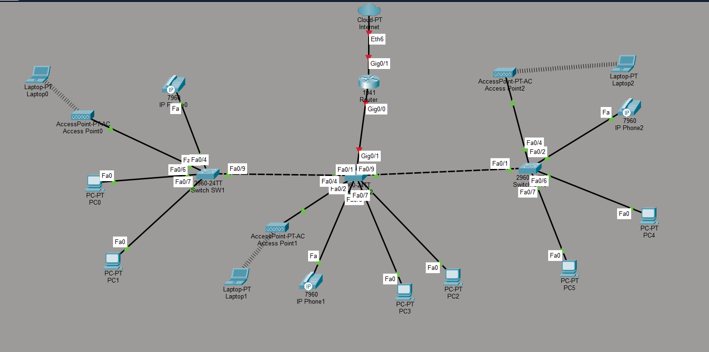

Vue avec l'affichage permanent des labels de ports (*Options → Preferences →
Always Show Port Labels*). Elle permet de vérifier d'un coup d'œil que chaque
équipement est branché sur le port imposé par l'énoncé : `Fa0/2` pour la
téléphonie, `Fa0/4` pour le point d'accès, `Fa0/6-7` pour les PC fixes,
`Fa0/1` et `Fa0/9` pour les uplinks.

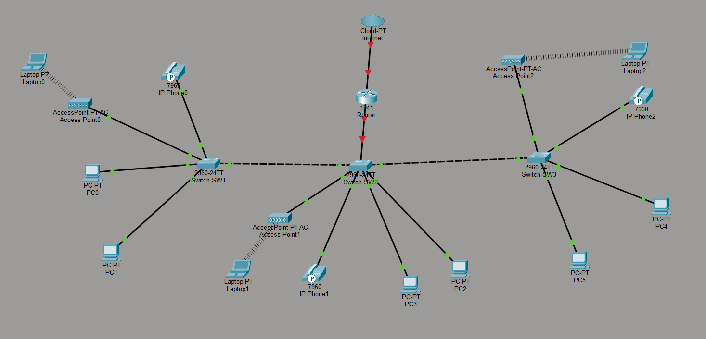

Vue d'ensemble des trois bureaux. Les liaisons en pointillés fins entre chaque
portable et son point d'accès matérialisent les associations Wi-Fi ; les
pointillés larges entre les switches sont les trunks 802.1Q.

### 9.2 Vérification des VLAN sur SW1

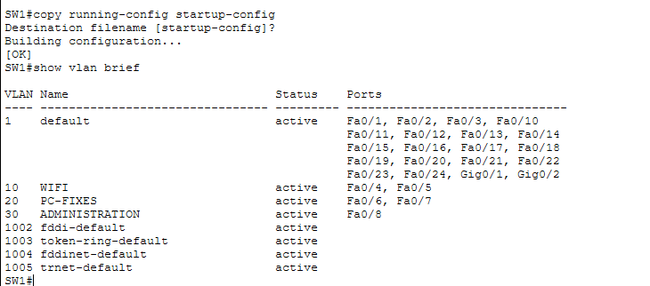

Les trois VLAN créés apparaissent avec leurs ports : `WIFI` (10) sur Fa0/4-5,
`PC-FIXES` (20) sur Fa0/6-7, `ADMINISTRATION` (30) sur Fa0/8. Le VLAN 1 porte
la téléphonie sur Fa0/2-3.

Détail à relever : `Fa0/9` **n'apparaît dans aucune ligne**. C'est le
comportement attendu — `show vlan brief` ne liste que les ports en mode
accès, un port en trunk en est exclu puisqu'il transporte tous les VLAN.

### 9.3 État détaillé des ports — SW1, SW2, SW3

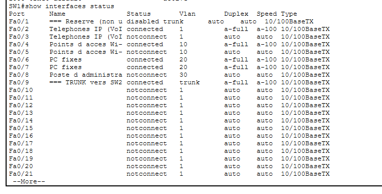

Vue plus complète que la précédente : elle croise pour chaque port son état,
son VLAN et sa description. `Fa0/1` est `disabled` — port de réserve
volontairement désactivé, un port actif non affecté étant un point d'entrée
pour qui se branche physiquement dans les locaux.

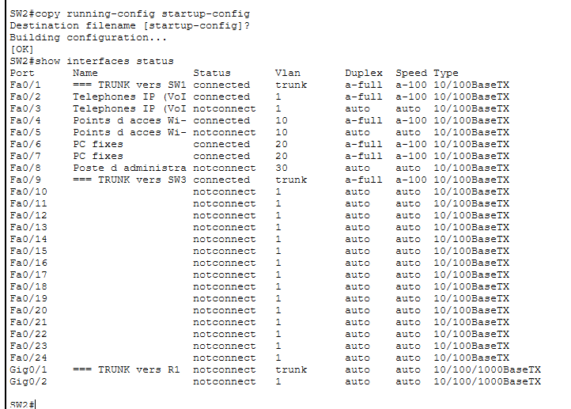

SW2 est le switch pivot : il porte **trois trunks**. `Fa0/1` vers SW1,
`Fa0/9` vers SW3, et `Gig0/1` vers le routeur. Ce choix libère les ports 1 et
9 pour le chaînage inter-bureaux tout en donnant au lien de collecte un débit
Gigabit, puisqu'il agrège le trafic des trois bureaux.

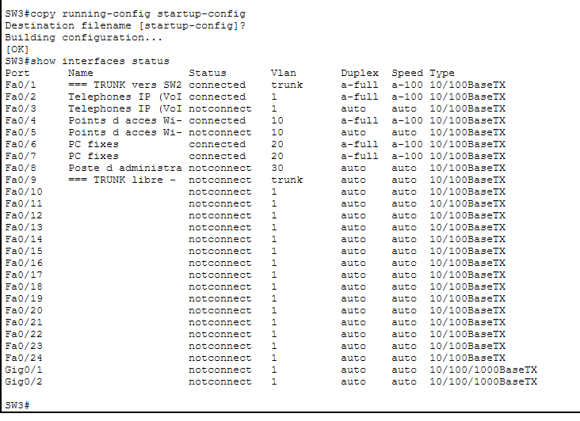

SW3 ferme la chaîne : `Fa0/1` en trunk vers SW2, `Fa0/9` resté libre pour une
extension. Les `notconnect` sur Fa0/3, Fa0/5 et Fa0/8 correspondent aux ports
de réserve prévus par l'énoncé sans équipement raccordé.

### 9.4 Routage inter-VLAN sur le routeur

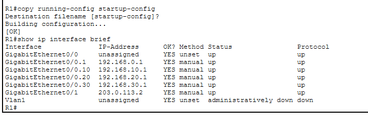

Les quatre sous-interfaces 802.1Q sont `up/up` avec leur passerelle
respective : `Gi0/0.1` en 192.168.0.1, `.10` en 192.168.10.1, `.20` en
192.168.20.1, `.30` en 192.168.30.1. L'interface physique `Gi0/0` reste sans
adresse, elle ne fait que porter le trunk.

C'est le montage *router on a stick*, rendu nécessaire par le 1941 qui ne
dispose que de deux ports Gigabit : quatre VLAN à router et une sortie WAN ne
peuvent pas tenir sur deux interfaces physiques.

### 9.5 Attribution DHCP côté client

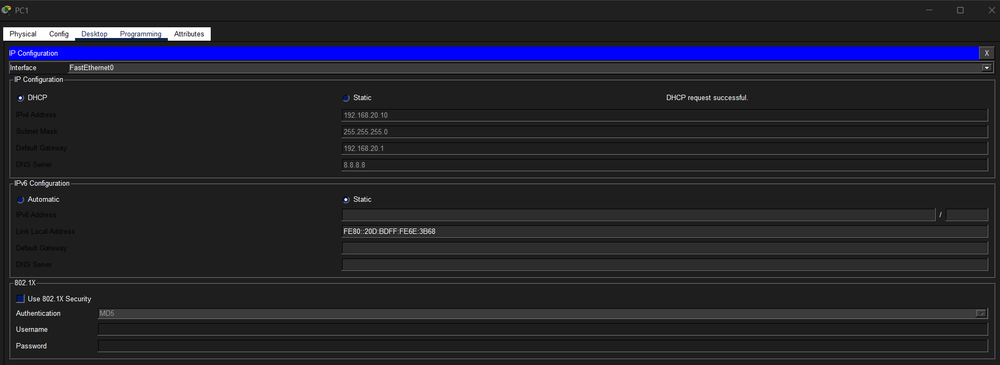

`DHCP request successful` sur un PC fixe du bureau 1 : adresse
192.168.20.10, passerelle 192.168.20.1, DNS 8.8.8.8. L'adresse est bien la
première de la plage `.10 – .50` imposée par l'énoncé, ce qui valide les
`ip dhcp excluded-address`.

### 9.6 Baux DHCP côté serveur

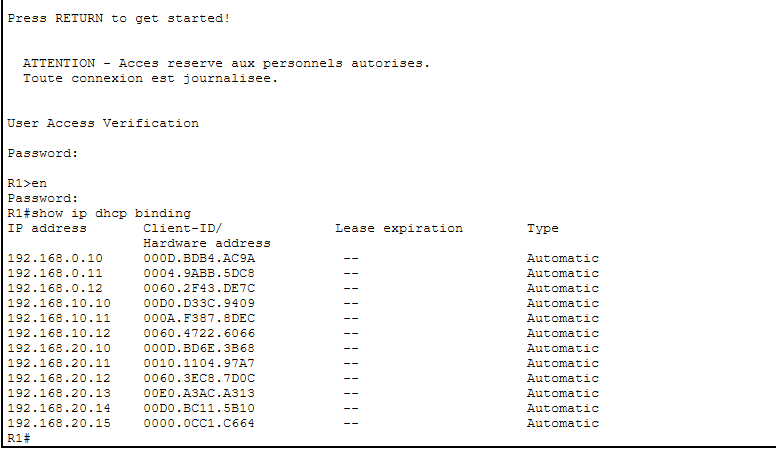

**La capture qui résume l'exercice.** Les douze terminaux ont obtenu un bail
dans le bon sous-réseau :

| Terminaux | Plage obtenue | VLAN |
|-----------|---------------|------|
| 3 téléphones IP | 192.168.0.10 – .12 | 1 |
| 3 portables Wi-Fi | 192.168.10.10 – .12 | 10 |
| 6 PC fixes | 192.168.20.10 – .15 | 20 |

Chaque terminal a atterri dans le VLAN correspondant à son port, et le
routeur a répondu depuis le bon pool. Segmentation, trunking et DHCP sont
validés d'un seul écran.

On note aussi le bandeau d'avertissement et la double authentification
(console puis `enable`) issus du durcissement appliqué au routeur.

### 9.7 Tests de connectivité

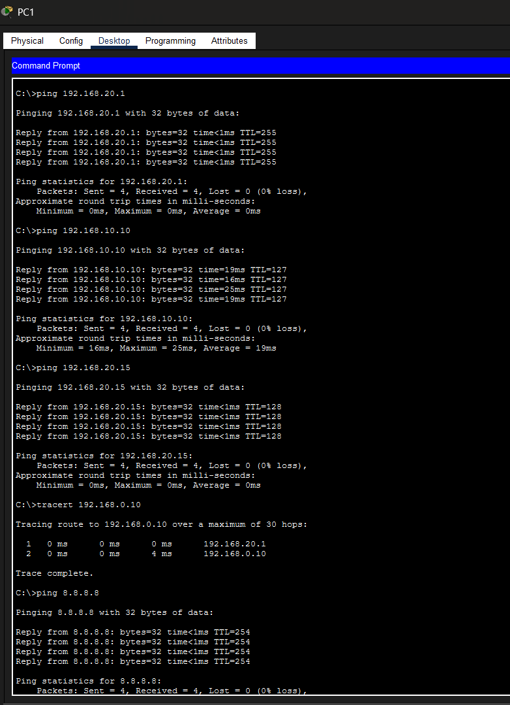

Cinq tests depuis un PC fixe du bureau 1, tous à 0 % de perte :

| Test | Ce qu'il démontre |
|------|-------------------|
| `ping 192.168.20.1` | Accès à la passerelle du VLAN |
| `ping 192.168.10.10` | **Routage inter-VLAN** vers un portable Wi-Fi |
| `ping 192.168.20.15` | Traversée des deux trunks jusqu'au bureau 3 |
| `tracert 192.168.0.10` | Chemin explicite : premier saut par 192.168.20.1 |
| `ping 8.8.8.8` | Sortie Internet à travers le NAT |

Le `tracert` est le plus démonstratif : les deux sauts affichés prouvent que
le trafic entre VLAN transite bien par le routeur et non par un chemin de
niveau 2.

Concernant l'accès Internet, le `Cloud-PT` seul ne répond à rien — c'est un
équipement passif. Un routeur `ISP` a donc été ajouté en 203.0.113.1, avec
une interface `Loopback0` adressée en 8.8.8.8 pour simuler un hôte public
joignable sans avoir à déployer de serveur supplémentaire.

### 9.8 Traduction NAT


La table montre l'adresse privée `192.168.20.10` traduite vers l'unique
adresse publique `203.0.113.2`, avec un numéro de port différent par session.
C'est le principe du NAT overload (PAT) : une seule adresse publique
multiplexée par port, permettant aux terminaux des quatre VLAN de sortir
simultanément.

### 9.9 Contrôle d'accès SSH

Deux tests menés depuis un poste bureautique, avec pour seule variable le
port du switch sur lequel il est raccordé — donc son VLAN d'appartenance.

**Depuis le VLAN 30 (administration) — session accordée**

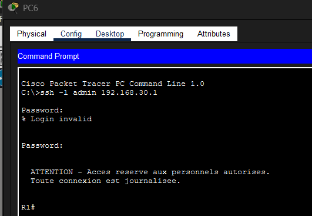

La session s'ouvre sur l'invite `R1#`. Le niveau privilégié est atteint
directement, sans passer par `enable` : le compte est déclaré en
`privilege 15`, et `login local` applique ce niveau dès l'authentification.

On note aussi un `% Login invalid` sur la première tentative — une faute de
frappe. Le paramètre `ip ssh authentication-retries 2` a autorisé une seconde
saisie ; une troisième erreur aurait fermé la session, ce qui limite les
tentatives par connexion et rend une attaque par force brute coûteuse.

Le bandeau d'avertissement légal s'affiche avant l'invite, conformément au
`banner motd` configuré.

**Depuis le VLAN 20 (PC fixes) — session refusée**

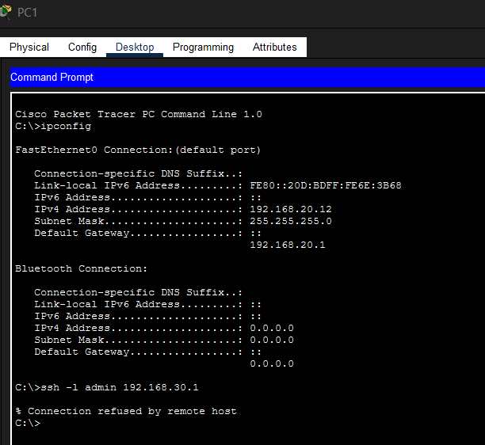

Le `ipconfig` établit l'adresse source : `192.168.20.12`, hors du périmètre
autorisé. La réponse est `% Connection refused by remote host`.

**C'est le test le plus important des deux.** Le refus provient de
l'`access-class SSH-ADMIN in` appliquée aux lignes vty : la connexion TCP est
rejetée avant toute demande d'identifiant. Aucun mot de passe n'est demandé,
donc aucune tentative n'est possible. Un attaquant présent sur le VLAN
bureautique — le plus exposé, puisque c'est celui des postes utilisateurs —
ne peut pas même commencer une attaque sur le compte d'administration.

| Origine | Adresse source | Résultat |
|---------|----------------|----------|
| VLAN 30 — administration | 192.168.30.x | Session ouverte, invite `R1#` |
| VLAN 20 — PC fixes | 192.168.20.12 | `Connection refused by remote host` |

Un point mis en évidence lors de ces tests mérite d'être signalé :
attribuer manuellement à un poste du VLAN 20 une adresse statique du VLAN 30
ne lui donne **aucun** accès supplémentaire. L'appartenance à un VLAN est
déterminée par la configuration du port du switch, jamais par l'adressage
déclaré sur l'hôte. C'est ce qui fait la solidité de la segmentation : elle
n'est pas contournable depuis le poste client.